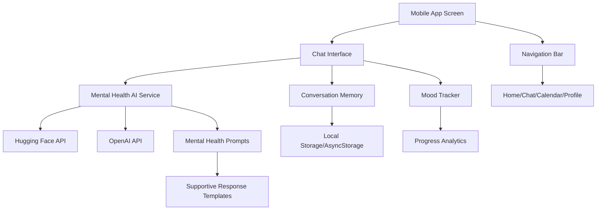

# Design Document

## Overview

This design outlines the integration of real AI capabilities into a mobile mental health companion app. The chatbot serves as a friendly buddy providing mental health support, emotional guidance, and mood tracking. The system will replace rule-based responses with either Hugging Face Inference API or OpenAI API calls specifically trained or prompted for mental health conversations, while maintaining conversation history and progress tracking in a mobile app environment.

## Architecture

### High-Level Architecture



### Mobile App Architecture

The application will use a mobile-first architecture with the following layers:

1. **Mobile UI Layer**: React Native/React components optimized for mobile screens
2. **Mental Health Service Layer**: AI integration with mental health-specific prompting
3. **Local Data Layer**: Secure local storage for sensitive conversation and mood data
4. **Navigation Layer**: Bottom tab navigation matching the provided UI design
5. **External APIs**: Mental health-trained AI models via Hugging Face or OpenAI

## Components and Interfaces

### Mental Health AI Service Interface

```typescript
interface MentalHealthAIService {
  generateSupportiveResponse(message: string, conversationHistory: Message[], userMood?: MoodData): Promise<AIResponse>
  isAvailable(): Promise<boolean>
  getProviderName(): string
  generateMoodInsight(moodHistory: MoodData[]): Promise<string>
}

interface AIResponse {
  text: string
  success: boolean
  error?: string
  supportLevel: 'low' | 'medium' | 'high' | 'crisis'
  suggestedActions?: string[]
  moodImpact?: 'positive' | 'neutral' | 'negative'
  metadata?: {
    model: string
    tokens?: number
    processingTime: number
  }
}
```

### Memory Service Interface

```typescript
interface MemoryService {
  saveMessage(message: Message): void
  getConversationHistory(limit?: number): Message[]
  clearHistory(): void
  saveUserProgress(progress: UserProgress): void
  getUserProgress(): UserProgress
}

interface Message {
  id: string
  role: 'user' | 'assistant'
  text: string
  timestamp: Date
  hasImage?: boolean
  imageUrl?: string
}
```

### Configuration Interface

```typescript
interface AIConfig {
  provider: 'huggingface' | 'openai'
  apiKey: string
  model?: string
  maxTokens?: number
  temperature?: number
}
```

## Data Models

### Message Model
- **id**: Unique identifier for each message
- **role**: Either 'user' or 'assistant'
- **text**: The message content
- **timestamp**: When the message was created
- **hasImage**: Boolean indicating if message includes image
- **imageUrl**: URL or placeholder for generated images

### Mental Health Progress Model
- **mood**: Current mood rating (1-10)
- **streak**: Consecutive days of check-ins
- **trend**: Overall mood trend ('improving', 'stable', 'declining')
- **logs**: Array of historical mood and conversation entries
- **lastInteraction**: Timestamp of last meaningful conversation
- **supportLevel**: Current support needs assessment
- **goals**: Personal mental health goals set by user
- **achievements**: Milestones and positive moments tracked

### Conversation Context Model
- **messages**: Array of recent messages with emotional context
- **userPersonality**: Learned communication preferences
- **triggerWords**: Identified words that indicate distress
- **supportHistory**: What types of support have been most effective
- **sessionMood**: Mood progression within current conversation
- **crisisIndicators**: Flags for concerning language or patterns

## Error Handling

### API Error Handling Strategy

1. **Network Errors**: Implement retry logic with exponential backoff
2. **Rate Limiting**: Queue requests and implement graceful degradation
3. **Authentication Errors**: Clear invalid tokens and prompt for re-authentication
4. **Service Unavailable**: Fall back to cached responses or offline mode
5. **Malformed Responses**: Parse and sanitize AI responses before display

### Error Recovery Patterns

```javascript
// Retry with exponential backoff
async function callAIWithRetry(message, maxRetries = 3) {
  for (let attempt = 1; attempt <= maxRetries; attempt++) {
    try {
      return await aiService.generateResponse(message);
    } catch (error) {
      if (attempt === maxRetries) throw error;
      await delay(Math.pow(2, attempt) * 1000);
    }
  }
}

// Graceful degradation
async function getAIResponse(message) {
  try {
    return await callAIWithRetry(message);
  } catch (error) {
    console.error('AI service failed:', error);
    return {
      text: "I'm having trouble connecting right now. Please try again in a moment.",
      success: false,
      error: error.message
    };
  }
}
```

## Testing Strategy

### Unit Testing
- **AI Service Tests**: Mock API responses and test error handling
- **Memory Service Tests**: Test localStorage operations and data persistence
- **Component Tests**: Test React components with mock data
- **Utility Function Tests**: Test helper functions and data transformations

### Integration Testing
- **API Integration**: Test actual API calls with test accounts
- **End-to-End Chat Flow**: Test complete conversation workflows
- **Memory Persistence**: Test data persistence across browser sessions
- **Error Scenarios**: Test various failure modes and recovery

### Testing Tools
- **Jest**: Unit testing framework
- **React Testing Library**: Component testing
- **MSW (Mock Service Worker)**: API mocking for tests
- **Cypress**: End-to-end testing

## Mobile App UI Design Implementation

### Mental Health App Design System

Based on the provided UI mockups, the mobile app design system will include:

1. **Typography**:
   - Primary font: Poppins (headings, navigation, buttons)
   - Secondary font: Quicksand (chat messages, body text)
   - Font weights: 400 (regular), 600 (semi-bold), 700 (bold)
   - Accessibility: Minimum 16px font size for readability

2. **Color Palette** (to be extracted from UI mockups):
   - Calming primary colors (likely blues/greens for mental health)
   - Warm accent colors for positive interactions
   - Soft backgrounds to reduce eye strain
   - High contrast for accessibility compliance
   - Mood-based color coding for progress tracking

3. **Mobile Component Styling**:
   - Touch-friendly button sizes (minimum 44px)
   - Chat bubbles optimized for mobile screens
   - Swipe gestures for navigation
   - Safe area handling for different device sizes
   - Haptic feedback for interactions

### Mobile Chat Interface Design

The chat interface will be optimized for mobile with:

- **Full-Screen Chat**: Maximized screen real estate for conversations
- **Message Layout**: User messages right-aligned, AI buddy messages left-aligned
- **Buddy Avatar**: Friendly AI companion avatar next to responses
- **Image Integration**: Supportive images/illustrations with AI responses
- **Mobile Input**: Keyboard-optimized input with emoji support
- **Voice Input**: Optional voice-to-text for accessibility
- **Typing Indicators**: Animated indicators showing AI is "thinking"
- **Message Status**: Read receipts and delivery confirmation

### Mobile Navigation Design

Following the mobile app navigation pattern:
- **Bottom Tab Navigation**: 5 main sections using provided icons
  - Home (Home_nav.svg)
  - Chat (Chatbot_nav.svg) 
  - Calendar (Calender_nav.svg)
  - Mood Tracking (Zenbloom_nav.svg)
  - Profile (settings.svg)
- **Active States**: Visual feedback with color changes and animations
- **Badge Notifications**: Unread message counts and mood reminders
- **Gesture Navigation**: Swipe between screens where appropriate

## Implementation Phases

### Phase 1: AI Service Integration
1. Create AI service abstraction layer
2. Implement Hugging Face Inference API integration
3. Implement OpenAI API integration as alternative
4. Add configuration management for API selection

### Phase 2: Memory Enhancement
1. Extend existing memory service for conversation history
2. Implement conversation context management
3. Add progress tracking integration with AI responses
4. Ensure backward compatibility with existing data

### Phase 3: UI Enhancement
1. Extract exact colors and styles from UI mockups
2. Update chat components to match Figma designs
3. Integrate provided icons and assets
4. Add image placeholder functionality

### Phase 4: Error Handling & Polish
1. Implement comprehensive error handling
2. Add loading states and user feedback
3. Optimize performance and API usage
4. Add configuration options for users

## Security & Privacy Considerations

### Mental Health Data Protection
- **HIPAA Compliance**: Ensure all mental health data handling meets healthcare privacy standards
- **Local Data Storage**: Keep sensitive conversations and mood data on device when possible
- **Encryption**: Encrypt all stored mental health data at rest and in transit
- **Data Minimization**: Only collect and store necessary data for functionality
- **User Control**: Provide granular privacy controls and data deletion options

### API Key Management
- Store API keys securely (environment variables, never in client code)
- Implement key rotation capabilities
- Use least-privilege access patterns
- Monitor API usage for unusual patterns

### Crisis Detection & Safety
- **Crisis Keywords**: Implement detection for self-harm or suicide ideation
- **Emergency Resources**: Provide immediate access to crisis hotlines and resources
- **Professional Referral**: Clear pathways to connect users with mental health professionals
- **Liability Considerations**: Clear disclaimers about AI limitations in crisis situations

### Content Safety
- **Response Filtering**: Ensure AI responses are appropriate for mental health context
- **Harmful Content Prevention**: Block or flag potentially harmful advice
- **Professional Boundaries**: Maintain clear boundaries about AI vs. professional therapy

## Performance Optimization

### API Optimization
- Implement request debouncing for rapid inputs
- Cache frequently used responses
- Optimize conversation context size
- Use streaming responses when available

### UI Performance
- Implement virtual scrolling for long conversations
- Lazy load images and media content
- Optimize re-renders with React.memo
- Use efficient state management patterns

## Future Extensibility

### Image Generation Integration
The current design includes dummy image placeholders that can be easily replaced with:
- DALL-E integration for OpenAI users
- Stable Diffusion API for open-source alternatives
- Local image generation models
- User-uploaded image support

### Mental Health Feature Extensions
- **Voice Therapy Sessions**: Voice input/output for more natural conversations
- **Mood Pattern Recognition**: AI analysis of mood patterns and triggers
- **Personalized Coping Strategies**: AI-generated coping mechanisms based on user history
- **Integration with Wearables**: Heart rate, sleep data for holistic mental health tracking
- **Group Support Features**: Anonymous peer support communities
- **Professional Integration**: Secure sharing of progress with therapists/counselors
- **Mindfulness & Meditation**: AI-guided meditation and breathing exercises
- **Crisis Prevention**: Predictive modeling to identify potential mental health crises